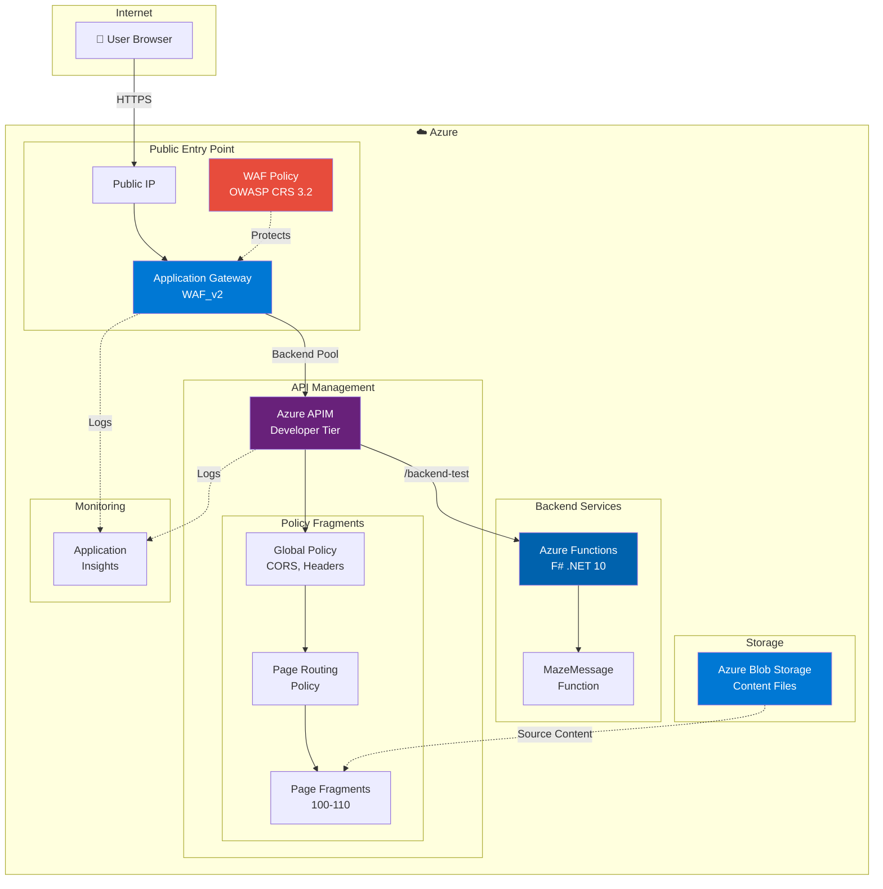

# txttv

TXT TV done with APIM to showcase WAF capabilities in AppGW

## Architecture



## Components

| Component | SKU/Tier | Purpose |
|-----------|----------|---------|
| **Application Gateway** | WAF_v2 | Public entry point with WAF protection |
| **WAF Policy** | OWASP CRS 3.2 | SQL injection, XSS, rate limiting (100 req/min) |
| **API Management** | Developer | Policy-based HTML rendering (primary logic) |
| **Azure Functions** | Consumption (Y1) | Minimal F# backend for demo |
| **Blob Storage** | Standard_LRS | Content source files |
| **Application Insights** | - | Monitoring and diagnostics |

## Request Flow

1. **User** requests `/page/100` via browser
2. **Application Gateway** receives request, WAF validates against OWASP rules
3. **APIM** routes request through global policy → page routing policy
4. **Policy Fragment** (page-100.xml) returns pre-rendered HTML with HTMX
5. **Browser** renders teletext-style page with navigation controls

## Quick Start

```powershell
# Convert content to policy fragments
.\infrastructure\scripts\convert-txt-to-fragment.ps1

# Deploy infrastructure using deployment stack
az stack group create \
  --name txttv-dev-stack \
  --resource-group txttv-dev-rg \
  --template-file infrastructure/environments/dev/main.bicep \
  --parameters @infrastructure/environments/dev/parameters.json
```
