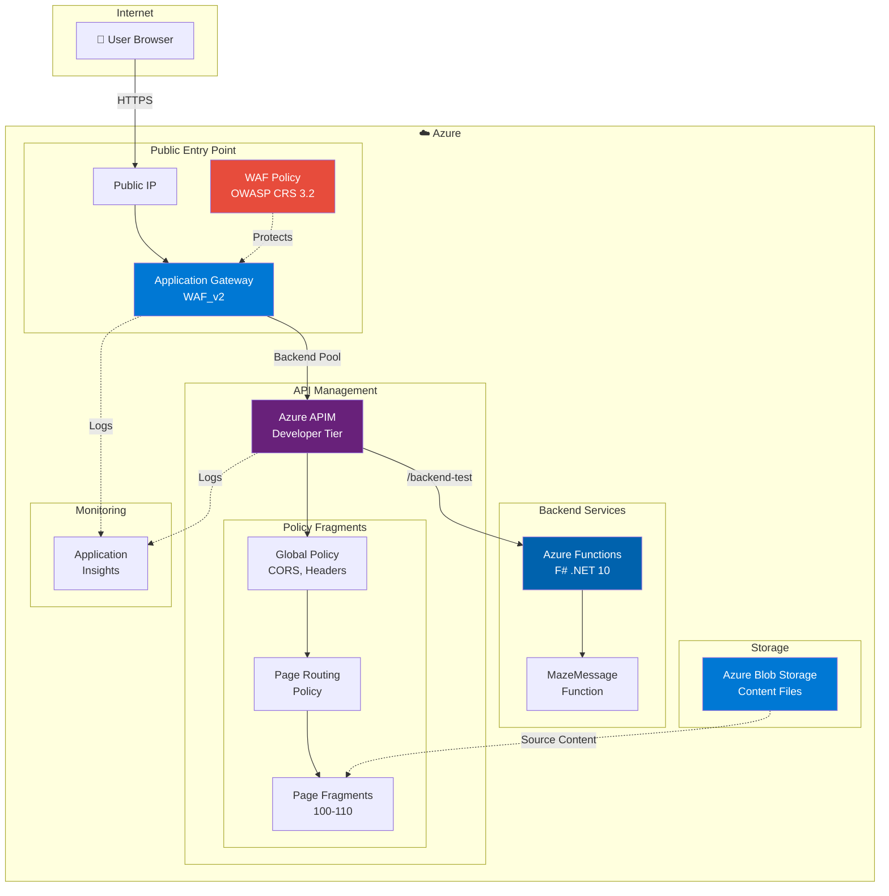

# txttv

TXT TV done with APIM to showcase WAF capabilities in AppGW

## Architecture



## Components

| Component | SKU/Tier | Purpose |
|-----------|----------|---------|
| **Application Gateway** | WAF_v2 | Public entry point with WAF protection |
| **WAF Policy** | OWASP CRS 3.2 | SQL injection, XSS, rate limiting (100 req/min) |
| **API Management** | Developer | Policy-based HTML rendering (primary logic) |
| **Azure Functions** | Consumption (Y1) | Minimal F# backend for demo |
| **Blob Storage** | Standard_LRS | Content source files |
| **Application Insights** | - | Monitoring and diagnostics |

## Request Flow

1. **User** requests `/page/100` via browser
2. **Application Gateway** receives request, WAF validates against OWASP rules
3. **APIM** routes request through global policy → page routing policy
4. **Policy Fragment** (page-100.xml) returns pre-rendered HTML with HTMX
5. **Browser** renders teletext-style page with navigation controls

## Local Development

### Prerequisites

- **PowerShell 7+**: Included in Windows, or download from [microsoft.com/powershell](https://docs.microsoft.com/powershell/)
- **Web Browser**: Any modern browser (Chrome, Edge, Firefox)

### Quick Start

```powershell
# Open the web interface in your default browser
.\infrastructure\scripts\start-dev-server.ps1

# Or open directly
Start-Process src\web\index.html
```

The local development environment allows you to edit HTML, CSS, and JavaScript files. Refresh your browser to see changes.

For detailed setup instructions and workflow, see [Local Development Guide](specs/004-local-web-dev/quickstart.md).

## Deployment Quick Start

```powershell
# Convert content to policy fragments
.\infrastructure\scripts\convert-txt-to-fragment.ps1

# Deploy infrastructure using deployment stack
az stack group create \
  --name txttv-dev-stack \
  --resource-group txttv-dev-rg \
  --template-file infrastructure/main.bicep \
  --parameters @infrastructure/parameters.json
```

## Local Development Workflow

The TxtTV application supports local browser-based development before converting to Azure APIM policies:

1. **Edit**: Modify HTML, CSS, and JavaScript in `src/web/` and refresh browser to see changes
2. **Convert**: Run `.\infrastructure\scripts\convert-web-to-apim.ps1` to generate policy fragments
3. **Deploy**: Push fragments to Azure using the deployment quick start above

This workflow enables rapid iteration with instant browser feedback, then automated conversion to production-ready policy fragments with 4-layer validation (XML → Schema → Security → Integration).

For complete setup instructions, see [Local Development Guide](specs/004-local-web-dev/quickstart.md).

